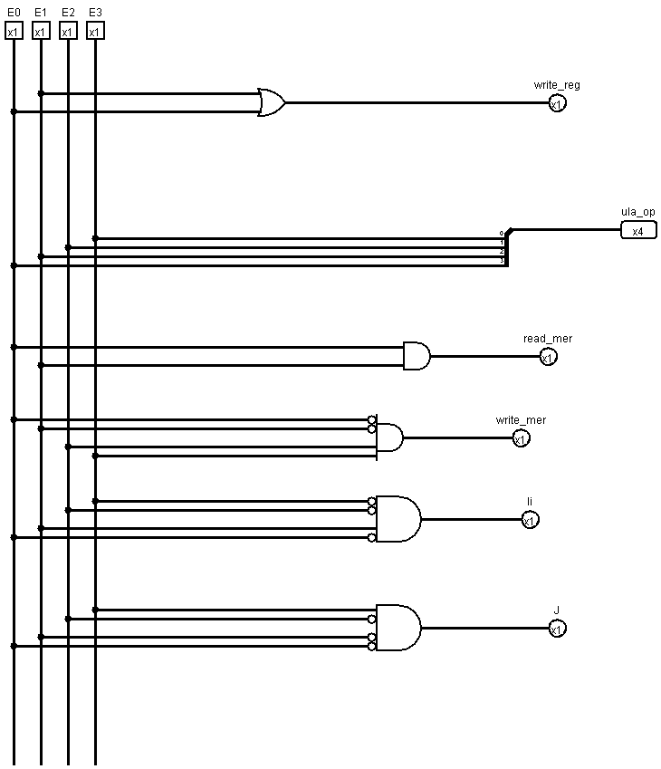
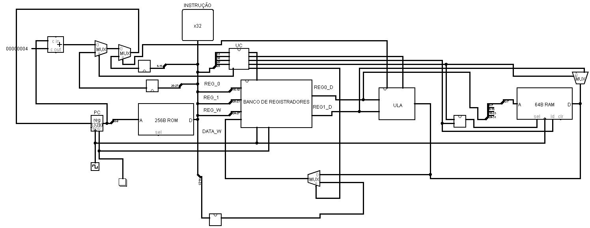

# Descrição

Este projeto consistiu na criação de um processador capaz de calcular a multiplicação de matrizes 4x4. O processador foi desenvolvido com base na arquitetura MIPS.

## Comandos

Os seguintes comandos foram implementados:

| Comandos | Binário | Hexadecimal |
|----------|---------|-------------|
| add      | 1001    | 9           |
| sub      | 1011    | b           |
| mul      | 0100    | 4           |
| li       | 0100    | 4           |
| lw       | 1100    | c           |
| sw       | 0011    | 3           |
| j        | 0001    | 1           |
| bge      | 0010    | 2           |

1. `add` - Soma dois registradores. Por exemplo, em "9f810000" soma o registro 8 com 1 e salva em f.
2. `sub` - Subtrai dois registradores, com estrutura de comando semelhante ao add.
3. ` mul`  - Multiplica dois registradores, com estrutura de comando semelhante ao add.
4. ` li`  - Carrega um imediato no registrador. Por exemplo, "44100000" carrega o 16 no registrador 4. Este comando usa o 3º e 4º bit para o número a ser carregado, e 10 em hexadecimal é 16 em decimal.
5. ` lw` - Lê o conteúdo da memória e salva em um registrador. Por exemplo, "c4050000" carrega no registrador 4 o conteúdo contido na memória no endereço contido no registrador 5. O 3º bit tem que ser 0 para o comando funcionar.
6. ` sw`  - Escreve na memória o conteúdo do registrador em um endereço. Por exemplo, "30510000" escreve na memória o conteúdo do registrador 5 no endereço contido no registrador 1. O 2º bit tem que ser zero.
7. ` j`  - Salta para o endereço na memória de instrução. Por exemplo, "11000000" salta para a instrução 16.
8. ` bge`  - Compara os dois registradores e, se o primeiro for maior ou igual, salta para o endereço da memória de instrução. Por exemplo, "20628800", compara se o registrador 6 é maior ou igual ao registrador 8, se for verdadeiro, salta para o endereço 88 da memória de instrução. O 2º bit tem que ser 0, e o 5º e o 6º são o endereço.

# Implementação do processador

## Unidade de controle

A tabela abaixo relaciona os comandos com as saídas da Unidade de Controle:

| Comandos | ula_op | write_reg | read_mem | write_mem | saltar | li |
|----------|--------|-----------|----------|-----------|--------|----|
| add      | 1001   | 1         | 0        | 0         | 0      | 0  |
| sub      | 1011   | 1         | 0        | 0         | 0      | 0  |
| mul      | 0100   | 1         | 0        | 0         | 0      | 0  |
| li       | 0100   | 1         | 0        | 0         | 0      | 1  |
| lw       | 1100   | 1         | 1        | 0         | 0      | 0  |
| sw       | 0011   | 0         | 0        | 1         | 0      | 0  |
| j        | 0001   | 0         | 0        | 0         | 1      | 0  |
| bge      | 0010   | 0         | 0        | 0         | 0      | 0  |

1. `ula_op` indica para a ULA qual operação deve ser realizada.
2. `write_reg` indica que a operação pode escrever no banco de registradores.
3. `read_mem` indica que a operação pode ler a memória de dados.
4. `write_mem` indica que a operação pode escrever na memória de dados.
5. `saltar` indica que haverá um salto.
6. `li` indica para salvar o valor diretamente no banco de registradores.

# Processado 
